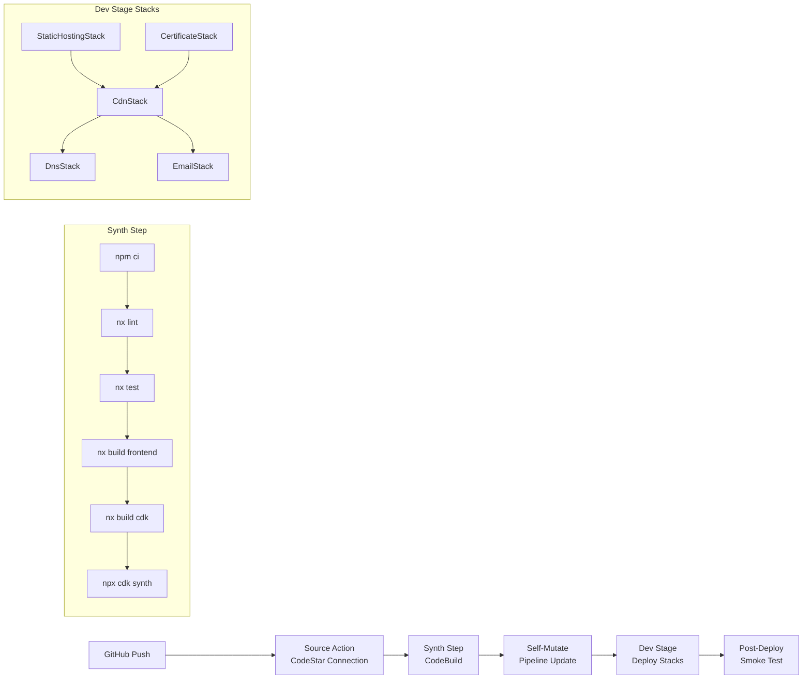
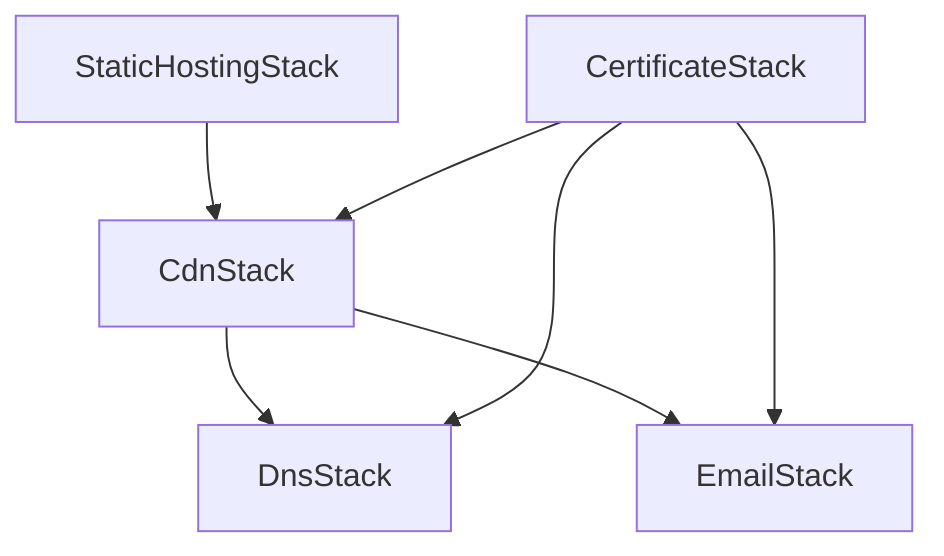

# Design Document: CDK Pipeline

## Overview

This design describes a self-mutating CI/CD pipeline for the YasMade project using the AWS CDK Pipelines (`aws-cdk-lib/pipelines`) high-level construct library. The pipeline is triggered by GitHub pushes, runs lint/test/build via Nx, synthesizes the CDK app, and deploys all infrastructure stacks to the dev environment. The pipeline itself is defined as a CDK stack, following the project's existing domain-based directory structure.

Key design decisions:

- Use the modern `CodePipeline` construct from `aws-cdk-lib/pipelines` (not the lower-level `aws-codepipeline`)
- Use `CodeBuildStep` for the synth step to get full control over build commands
- Use `crossAccountKeys: false` since we're deploying to a single account (saves $1/month KMS cost)
- Use a dedicated `Stage` construct to group all dev stacks for atomic deployment
- Use a separate CDK app entry point (`pipeline-app.ts`) to keep pipeline definition isolated from the main app

## Architecture



The pipeline runs entirely within a single AWS account. The CodeStar Connection authenticates with GitHub, and the pipeline uses the default CDK bootstrap roles for deployment.

## Components and Interfaces

### 1. PipelineStack

The top-level CDK stack that defines the CodePipeline.

```typescript
interface PipelineStackProps extends StackProps {
  /** GitHub repository owner (e.g., "elprince-dev") */
  readonly githubOwner: string;
  /** GitHub repository name */
  readonly githubRepo: string;
  /** Branch to track (e.g., "main") */
  readonly branch: string;
  /** ARN of the CodeStar Connection to GitHub */
  readonly connectionArn: string;
  /** Environment config for the dev stage */
  readonly devConfig: EnvironmentConfig;
}
```

Responsibilities:

- Creates the `CodePipeline` with self-mutation enabled
- Configures the GitHub source via `CodePipelineSource.connection()`
- Defines the `ShellStep` synth step with all build commands
- Adds the `DevStage` to the pipeline
- Adds post-deployment validation step

### 2. DevStage

A CDK `Stage` that groups all dev environment stacks.

```typescript
interface DevStageProps extends StageProps {
  readonly environmentConfig: EnvironmentConfig;
}
```

Responsibilities:

- Instantiates all five stacks (StaticHosting, Certificate, CDN, DNS, Email) with dev config
- Manages inter-stack dependencies (CDN depends on StaticHosting and Certificate, DNS and Email depend on CDN and Certificate)
- Exposes the CloudFront distribution URL as a `CfnOutput` for post-deployment validation

### 3. Pipeline App Entry Point (`pipeline-app.ts`)

A separate CDK app entry point that instantiates only the `PipelineStack`. This keeps the pipeline definition isolated from the main `app.ts` which is used for direct `cdk deploy` during development.

```typescript
// packages/cdk/src/bin/pipeline-app.ts
const app = new cdk.App();
new PipelineStack(app, 'YasMade-Pipeline', {
  env: { account: devConfig.account, region: devConfig.region },
  githubOwner: 'elprince-dev',
  githubRepo: 'yas-made-aws',
  branch: 'main',
  connectionArn:
    app.node.tryGetContext('connectionArn') ||
    process.env.CODESTAR_CONNECTION_ARN ||
    '',
  devConfig,
});
```

### 4. Pipeline Configuration

Pipeline-specific configuration values stored alongside the existing environment configs.

```typescript
interface PipelineConfig {
  readonly githubOwner: string;
  readonly githubRepo: string;
  readonly branch: string;
  readonly connectionArn: string;
  readonly synthCommands: string[];
}
```

The `connectionArn` is provided via CDK context (`-c connectionArn=arn:...`) or environment variable, keeping it out of source code.

### 5. Synth Step

The synth step runs in CodeBuild and executes the following commands in order:

```bash
npm ci
npx nx run-many -t lint --all
npx nx run-many -t test --all
npx nx run frontend:build
npx nx run cdk:build
npx cdk synth -a "node packages/cdk/src/bin/pipeline-app.js"
```

Environment variables for the frontend build (Supabase URL, anon key) are injected from SSM Parameter Store using `CodeBuildStep.envFromCfnOutputs` or direct SSM references in the build environment.

### 6. Post-Deployment Validation

A `ShellStep` added after the dev stage that performs a simple HTTP health check:

```bash
curl -f https://dev.yasmade.net || exit 1
```

This validates that the CloudFront distribution is serving content after deployment.

## Data Models

### Stack Dependency Graph



### SSM Parameter Store Layout

| Parameter Path                   | Description                    |
| -------------------------------- | ------------------------------ |
| `/yasmade/dev/supabase-url`      | Supabase project URL for dev   |
| `/yasmade/dev/supabase-anon-key` | Supabase anonymous key for dev |

### Pipeline Environment Variables

| Variable                 | Source                | Used By        |
| ------------------------ | --------------------- | -------------- |
| `VITE_SUPABASE_URL`      | SSM Parameter Store   | Frontend build |
| `VITE_SUPABASE_ANON_KEY` | SSM Parameter Store   | Frontend build |
| `CDK_DEFAULT_ACCOUNT`    | CodeBuild environment | CDK synth      |
| `CDK_DEFAULT_REGION`     | CodeBuild environment | CDK synth      |

## Correctness Properties

_A property is a characteristic or behavior that should hold true across all valid executions of a system — essentially, a formal statement about what the system should do. Properties serve as the bridge between human-readable specifications and machine-verifiable correctness guarantees._

Based on the prework analysis, the following testable properties were identified. Many acceptance criteria relate to infrastructure wiring (CodePipeline runtime behavior) or file organization, which are not amenable to property-based testing. The testable properties focus on the synthesized CloudFormation template structure.

### Property 1: Config parameter passthrough

_For any_ valid combination of GitHub owner, repository name, branch, and connection ARN, synthesizing the PipelineStack SHALL produce a CloudFormation template where the CodePipeline source action references those exact configuration values.

**Validates: Requirements 1.3**

### Property 2: Dev stage contains all required stacks

_For any_ valid EnvironmentConfig, the DevStage SHALL contain exactly five stacks: StaticHostingStack, CertificateStack, CdnStack, DnsStack, and EmailStack.

**Validates: Requirements 3.1, 3.2**

### Property 3: Stack dependency ordering in DevStage

_For any_ valid EnvironmentConfig, within the DevStage the CdnStack SHALL depend on both StaticHostingStack and CertificateStack, and the DnsStack and EmailStack SHALL depend on CertificateStack.

**Validates: Requirements 3.3**

## Error Handling

| Scenario                                 | Handling                                                                                                                   |
| ---------------------------------------- | -------------------------------------------------------------------------------------------------------------------------- |
| Synth step fails (lint/test/build error) | CodePipeline halts execution automatically. The failed step is visible in the CodePipeline console with logs in CodeBuild. |
| Stack deployment fails                   | CloudFormation rolls back the failed stack. Pipeline halts at the failed stage.                                            |
| Post-deployment smoke test fails         | Pipeline marks the stage as failed. The `curl -f` command returns non-zero exit code.                                      |
| CodeStar connection not authorized       | Pipeline fails at the source stage. Requires manual authorization in the AWS Console.                                      |
| SSM parameters missing                   | CDK synth fails because environment variables are empty. Pipeline halts at synth step.                                     |
| Self-mutation fails                      | Pipeline fails at the UpdatePipeline stage. Requires manual intervention to fix the pipeline code and redeploy.            |

## Testing Strategy

### Unit Tests

Unit tests verify the synthesized CloudFormation templates using CDK's `assertions` module (`aws-cdk-lib/assertions`):

- Verify PipelineStack synthesizes without errors
- Verify the pipeline has a CodeStar source connection
- Verify the synth step contains expected build commands in correct order
- Verify self-mutation is enabled
- Verify the dev stage is present with all five stacks
- Verify post-deployment validation step exists
- Verify SSM parameter references are present in the template

### Property-Based Tests

Property-based tests use `fast-check` (already a dev dependency in the CDK package) to verify structural properties across randomized inputs:

- **Property 1**: Generate random valid GitHub config values (owner, repo, branch, connectionArn) and verify they appear in the synthesized template
- **Property 2**: Generate random valid EnvironmentConfig values and verify the DevStage contains all five stacks
- **Property 3**: Generate random valid EnvironmentConfig values and verify stack dependency ordering

Each property test runs a minimum of 100 iterations. Tests are tagged with:

- **Feature: cdk-pipeline, Property {N}: {property_text}**

### Testing Framework

- **Unit tests**: Jest (existing setup in `packages/cdk/jest.config.js`)
- **Property tests**: fast-check (`fast-check` already in `packages/cdk/package.json` devDependencies)
- **CDK assertions**: `aws-cdk-lib/assertions` (Template.fromStack, Match helpers)
