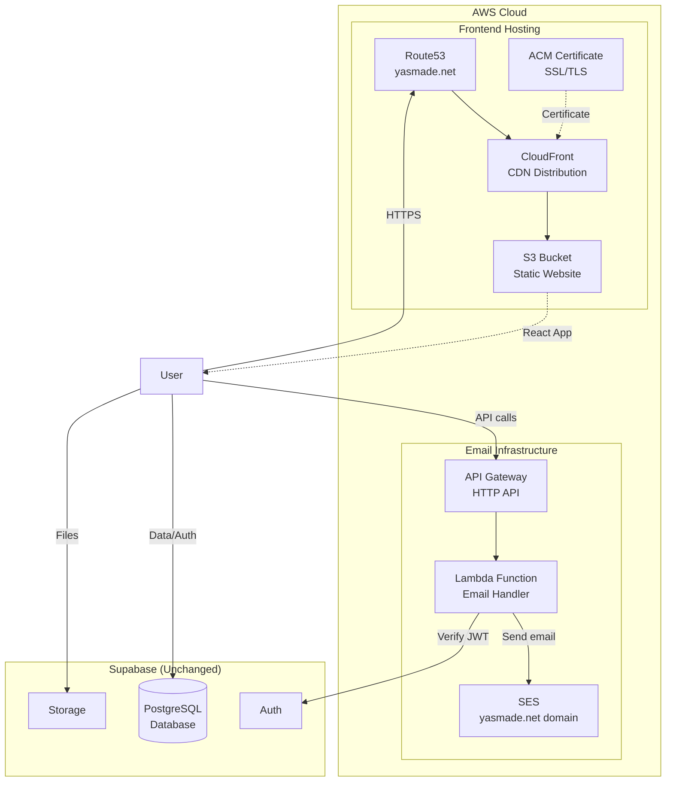

# Design Document: SES Email Integration & AWS Hosting

## Overview

This design covers migrating the YasMade frontend to AWS (S3 + CloudFront + Route53 + ACM), replacing all email sending with AWS SES via an API Gateway + Lambda email API, and cleaning up dead Stripe/Resend/EmailJS code.

The existing CDK project in `packages/cdk` already has well-structured constructs for S3, CloudFront, SSL, and DNS. This design builds on that foundation by:

1. Wiring the existing frontend constructs into a deployable app entry point
2. Adding a new `email` domain with SES, API Gateway, and Lambda constructs
3. Updating the frontend to call the new Email API
4. Removing dead code (Stripe, Resend, EmailJS)

## Architecture



## Components and Interfaces

### 1. CDK App Entry Point (`packages/cdk/src/bin/app.ts`)

The current entry point creates an empty `CdkStack`. It needs to be updated to instantiate the actual stacks in the correct order with cross-stack references.

Stack deployment order:

1. `StaticHostingStack` — creates S3 bucket
2. `DnsStack` — creates Route53 hosted zone, SSL certificate (needs to be refactored — see below)
3. `CdnStack` — creates CloudFront distribution (needs S3 bucket + certificate)
4. `EmailStack` — creates SES identity, API Gateway, Lambda

Note: The current `DnsStack` has a circular dependency — it takes a `distribution` as a prop but the `CdnStack` needs the certificate from `DnsStack`. This needs to be refactored into separate stacks or the DNS records need to be created after the CDN.

Proposed refactoring:

- `StaticHostingStack` — S3 bucket
- `CertificateStack` — ACM certificate + hosted zone (us-east-1, cross-region)
- `CdnStack` — CloudFront distribution (takes bucket + certificate)
- `DnsStack` — Route53 records pointing to CloudFront (takes distribution + hosted zone)
- `EmailStack` — SES + API Gateway + Lambda

### 2. Email Domain (`packages/cdk/src/domains/email/`)

New CDK domain for email infrastructure:

```
packages/cdk/src/domains/email/
├── constructs/
│   ├── ses-identity.ts        # SES domain identity + DKIM/SPF
│   └── email-api.ts           # API Gateway + Lambda
├── stacks/
│   └── email-stack.ts         # Combines SES + API Gateway + Lambda
└── lambda/
    └── email-handler.ts       # Lambda function source code
```

### 3. SES Identity Construct

```typescript
// packages/cdk/src/domains/email/constructs/ses-identity.ts
interface SesIdentityProps {
  domainName: string;
  hostedZone: IHostedZone;
  tags?: Record<string, string>;
}
```

This construct:

- Creates an `EmailIdentity` for `yasmade.net` using `Identity.domain()`
- DKIM is automatically configured by CDK's `EmailIdentity` construct
- Configures a MAIL FROM subdomain (`mail.yasmade.net`) for SPF alignment
- Adds the required DNS records (DKIM CNAME, SPF TXT, MX for MAIL FROM) to the Route53 hosted zone

### 4. Email API Construct

```typescript
// packages/cdk/src/domains/email/constructs/email-api.ts
interface EmailApiProps {
  sesIdentity: EmailIdentity;
  domainName: string;
  allowedOrigins: string[];
  adminEmail: string;
  tags?: Record<string, string>;
}
```

This construct:

- Creates a Lambda function (Node.js 20.x runtime) with the email handler code
- Grants the Lambda `ses:SendEmail` and `ses:SendRawEmail` permissions
- Creates an HTTP API (API Gateway v2) with CORS configured for the frontend domain
- Adds routes:
  - `POST /newsletter` — admin-authenticated newsletter sending
  - `POST /contact` — public contact form notification
  - `POST /order-confirmation` — admin-authenticated order confirmation
- Passes environment variables to Lambda: `ADMIN_EMAIL`, `DOMAIN_NAME`, `SUPABASE_URL`, `SUPABASE_ANON_KEY`

### 5. Lambda Email Handler

```typescript
// packages/cdk/src/domains/email/lambda/email-handler.ts
```

Single Lambda function with route-based dispatch. Uses the AWS SDK v3 `@aws-sdk/client-ses` (bundled in Lambda runtime).

**Request validation:**

- Newsletter: requires `subscribers[]`, `subject`, `content`, `logoUrl`
- Contact: requires `name`, `email`, `subject`, `message`
- Order confirmation: requires `orderId`, `customerEmail`, `items[]`, `shippingAddress`, `total`, `paymentProofUrl`

**Authentication:**

- Newsletter and order confirmation endpoints validate the `Authorization` header by decoding the Supabase JWT and checking the `aud` claim
- Contact endpoint is public but rate-limited via API Gateway throttling (10 requests/second, burst 20)

**Email templates:**

- Newsletter: reuses the existing HTML template structure from the Supabase Edge Function (logo, content, signature, footer)
- Contact notification: simple formatted email with sender details and reply-to header
- Order confirmation: order summary with items, totals, and e-transfer payment instructions

### 6. Email Stack

```typescript
// packages/cdk/src/domains/email/stacks/email-stack.ts
interface EmailStackProps extends StackProps {
  environmentConfig: EnvironmentConfig;
  hostedZone: IHostedZone;
}
```

Composes the SES identity and Email API constructs into a single deployable stack.

### 7. Frontend Changes

**AdminSubscribers.jsx:**

- Replace the Supabase Edge Function call with a fetch to `${VITE_EMAIL_API_URL}/newsletter`
- Keep the same request body structure (subscribers, subject, content, logoUrl)
- Use the Supabase session token in the Authorization header (same as current)

**ContactPage.jsx:**

- Remove EmailJS import and `sendForm` call
- Add a fetch to `${VITE_EMAIL_API_URL}/contact` after saving to Supabase
- Send `{ name, email, subject, message }` in the request body
- No auth header needed (public endpoint)

**CartPage.jsx / OrderConfirmationPage.jsx:**

- After order creation, call `${VITE_EMAIL_API_URL}/order-confirmation`
- Send order details in the request body
- Use the Supabase session token if available, or make it a public endpoint with the order ID as validation

**Environment variables:**

- Add `VITE_EMAIL_API_URL` to `.env.example` and frontend config

**Dependency cleanup:**

- Remove `@emailjs/browser`, `resend`, `@stripe/stripe-js`, `stripe` from `package.json`
- Delete `supabase/functions/stripe-product/` and `supabase/functions/create-checkout-session/`
- Remove EmailJS imports and hardcoded credentials from `ContactPage.jsx`

## Data Models

### Newsletter Request

```typescript
interface NewsletterRequest {
  subscribers: string[]; // Array of email addresses
  subject: string; // Email subject line
  content: string; // HTML content body
  logoUrl: string; // URL to YasMade logo image
}
```

### Contact Request

```typescript
interface ContactRequest {
  name: string; // Sender's name
  email: string; // Sender's email (used as reply-to)
  subject: string; // Message subject
  message: string; // Message body
}
```

### Order Confirmation Request

```typescript
interface OrderConfirmationRequest {
  orderId: string;
  customerEmail: string;
  customerName: string;
  items: Array<{
    name: string;
    quantity: number;
    price: number;
  }>;
  shippingAddress: {
    street: string;
    city: string;
    state: string;
    postal_code: string;
    country: string;
  };
  subtotal: number;
  shippingFee: number;
  discountAmount: number;
  totalAmount: number;
  paymentProofUrl: string; // URL where customer uploads e-transfer proof
}
```

### Lambda Response

```typescript
interface EmailApiResponse {
  success: boolean;
  messageId?: string; // SES message ID on success
  error?: string; // Error description on failure
  failedRecipients?: string[]; // For newsletter: list of failed sends
}
```

</text>
</invoke>

## Correctness Properties

_A property is a characteristic or behavior that should hold true across all valid executions of a system — essentially, a formal statement about what the system should do. Properties serve as the bridge between human-readable specifications and machine-verifiable correctness guarantees._

### Property 1: Request validation rejects incomplete payloads

_For any_ email API request body that is missing one or more required fields for its endpoint type (newsletter, contact, or order-confirmation), the handler SHALL return a 400 status code with a descriptive error message, and no email SHALL be sent.

**Validates: Requirements 5.3, 5.4**

### Property 2: JWT authentication gates admin endpoints

_For any_ request to the newsletter or order-confirmation endpoints, if the Authorization header is missing or contains an invalid/expired JWT, the handler SHALL return a 401 status code and no email SHALL be sent.

**Validates: Requirements 5.5, 5.6**

### Property 3: Newsletter sends to all subscribers

_For any_ valid newsletter request with a non-empty list of subscriber email addresses, the handler SHALL attempt to send an email to every address in the list via SES.

**Validates: Requirements 6.1**

### Property 4: Newsletter HTML template contains required elements

_For any_ newsletter content string and logo URL, the rendered HTML email SHALL contain the logo image tag, the provided content, a signature section with "Yasmeen Allam" and "YasMade", and a footer with unsubscribe text.

**Validates: Requirements 6.2**

### Property 5: Plain text generation strips all HTML

_For any_ HTML content string, the generated plain text version SHALL contain no HTML tags (no `<` followed by a tag name followed by `>`).

**Validates: Requirements 6.3**

### Property 6: Image URL absolutization

_For any_ HTML content string containing `` tags with relative `src` attributes, after processing, all `` `src` attributes SHALL be absolute URLs (starting with `http://` or `https://`).

**Validates: Requirements 6.4**

### Property 7: Contact notification email correctness

_For any_ valid contact form submission with name, email, subject, and message, the handler SHALL call SES with: the admin email as recipient, the visitor's email as reply-to, and the email body containing all four submitted fields.

**Validates: Requirements 7.1, 7.2, 7.3**

### Property 8: Order confirmation email completeness

_For any_ valid order confirmation request, the handler SHALL call SES with: the customer email and admin email as recipients, and the email body containing the order ID, all item names with quantities and prices, shipping address, discount amount, total amount, and payment proof upload link.

**Validates: Requirements 8.1, 8.2, 8.3, 8.4**

## Error Handling

### Lambda Error Handling

- All Lambda handler errors are caught and returned as JSON responses with appropriate HTTP status codes
- SES sending errors for individual recipients in newsletter bulk sends are collected and returned in `failedRecipients` without stopping the batch
- JWT validation errors return 401 with a generic "Unauthorized" message (no token details leaked)
- Request validation errors return 400 with specific field-level error messages
- Unexpected errors return 500 with a generic message; details are logged to CloudWatch

### Domain Migration from Namecheap

- The domain registration stays at Namecheap — no transfer needed
- Route53 creates a hosted zone which outputs 4 NS (nameserver) records
- After CDK deployment, update the nameservers in Namecheap's dashboard to point to the Route53 NS records
- DNS propagation typically takes 24-48 hours
- During propagation, the site may be intermittently available — plan for a low-traffic window
- The CDK stack output will display the exact NS records to configure

### CDK Deployment Error Handling

- SES domain verification may take time; CDK will wait for DNS propagation
- ACM certificate validation requires DNS records to be resolvable; the certificate construct uses DNS validation via Route53
- If SES is in sandbox mode, sending to unverified recipients will fail; the README documents how to request production access

### Frontend Error Handling

- Email API call failures are caught and displayed to the user via existing toast/error UI
- Network errors show a retry-friendly message
- The contact form still saves to Supabase even if the email notification fails (existing behavior preserved)

## Testing Strategy

### Unit Tests

- CDK snapshot tests for each stack to verify synthesized CloudFormation templates
- Lambda handler unit tests for each endpoint (newsletter, contact, order-confirmation)
- Request validation tests for edge cases (empty arrays, missing fields, malformed emails)
- Template rendering tests for specific known inputs

### Property-Based Tests

- Library: [fast-check](https://github.com/dubzzz/fast-check) for TypeScript property-based testing
- Minimum 100 iterations per property test
- Each property test references its design document property number
- Tag format: **Feature: ses-email-integration, Property {number}: {property_text}**

Properties to implement:

1. Request validation (Property 1)
2. JWT authentication (Property 2)
3. Newsletter bulk sending (Property 3)
4. Newsletter template rendering (Property 4)
5. Plain text generation (Property 5)
6. Image URL absolutization (Property 6)
7. Contact notification correctness (Property 7)
8. Order confirmation completeness (Property 8)

### CDK Infrastructure Tests

- Snapshot tests for `StaticHostingStack`, `CdnStack`, `DnsStack`, `CertificateStack`, `EmailStack`
- Assertion tests verifying key resource properties (S3 block public access, CloudFront error responses, SES identity, Lambda permissions)
