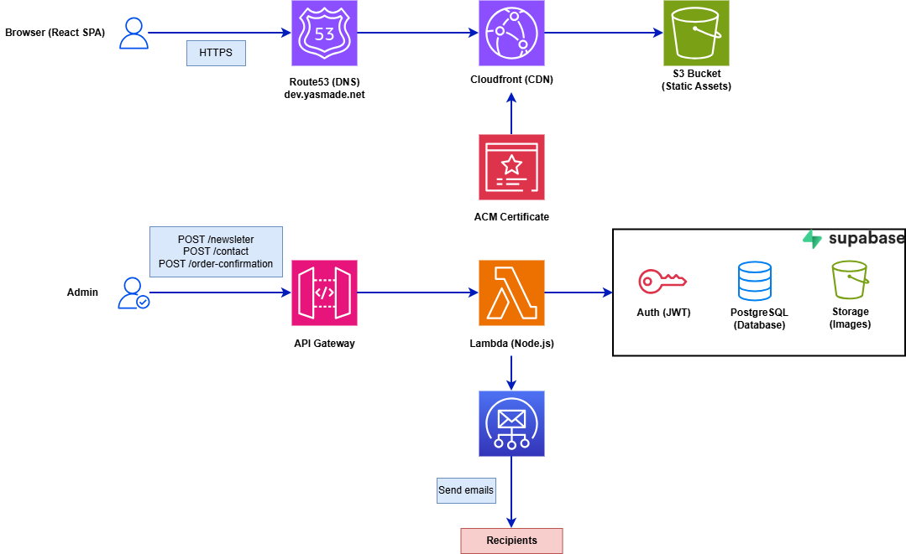

<div align="center">


# 🌸 YasMade — Handcrafted Embroidery & Creative Workshops

<p align="center">
  A modern e-commerce platform for artisanal embroidery, creative workshops, and Islamic-inspired art — powered by AWS.
</p>

<p align="center">
  <a href="https://dev.yasmade.net">🌐 Live Site</a> &nbsp;·&nbsp;
  <a href="#-architecture">Architecture</a> &nbsp;·&nbsp;
  <a href="#-quick-start">Quick Start</a> &nbsp;·&nbsp;
  <a href="#-cicd-pipeline">CI/CD</a>
</p>

---

## ✨ Overview

YasMade is a beautifully crafted, full-stack e-commerce platform that seamlessly blends traditional Islamic art with modern web technology. This project showcases the intersection of faith, creativity, and technology through handcrafted embroidery products, educational workshops, and a vibrant community experience.

This is the **AWS edition** — migrated from Netlify/Vercel to a fully managed AWS infrastructure using CDK, CloudFront, S3, SES, and a self-mutating CI/CD pipeline.

---

## 🎯 Key Features

- 🛍️ **E-commerce** — Product catalog, cart, and order management
- 🎓 **Workshops** — Browse and book creative sessions
- 📝 **Blog** — Content management with rich posts
- 🖼️ **Gallery** — Curated image gallery of handcrafted work
- 📬 **Contact** — Email contact form powered by AWS SES + Lambda
- 🔐 **Admin Dashboard** — Manage products, sessions, blog posts, and social links
- 🌙 **Dark Mode** — Theme toggle with system preference detection
- ♿ **Accessible** — Keyboard navigation and screen reader support

---

## 🏗️ Architecture

<p align="center">
  
</p>

### Infrastructure Stacks

| Stack | Resources | Purpose |
|-------|-----------|---------|
| **StaticHosting** | S3 (versioned, encrypted) | Hosts the React build output |
| **Certificate** | Route 53 Hosted Zone, ACM | DNS zone + SSL/TLS certificate |
| **CDN** | CloudFront, OAC | Global content delivery with edge caching |
| **DNS** | A, AAAA, www records | Routes `dev.yasmade.net` to CloudFront |
| **Email** | SES, Lambda, API Gateway v2 | Contact form email with JWT auth |
| **Pipeline** | CodePipeline, CodeBuild | Self-mutating CI/CD from GitHub |

---

## 🏗️ Tech Stack

| Layer | Technology | Purpose |
|-------|-----------|---------|
| Frontend | React 18 + Vite | Fast, modern UI framework |
| Styling | Tailwind CSS + Custom Design System | Responsive, beautiful design |
| State | Zustand | Lightweight cart state management |
| Routing | React Router v6 | Client-side navigation |
| Backend | Supabase | Database, authentication, storage |
| Email | AWS SES + Lambda + API Gateway | Transactional emails with JWT verification |
| Infrastructure | AWS CDK (TypeScript) | Infrastructure as code |
| CDN & DNS | CloudFront, Route 53, ACM | Global delivery + custom domain + SSL |
| CI/CD | AWS CodePipeline + CodeBuild | Automated build, test, and deploy |
| Monorepo | Nx + npm workspaces | Dependency graph and task orchestration |
| Testing | Jest, Vitest, Testing Library | Unit and integration tests |

---

## 📁 Project Structure

```
YasMadeAWS/
├── packages/
│   ├── frontend/                # React + Vite SPA
│   │   └── src/
│   │       ├── components/          # Reusable UI (layout, auth, home, common)
│   │       ├── pages/               # Route pages
│   │       │   ├── HomePage.jsx
│   │       │   ├── ProductsPage.jsx
│   │       │   ├── ProductDetailPage.jsx
│   │       │   ├── CartPage.jsx
│   │       │   ├── SessionsPage.jsx
│   │       │   ├── GalleryPage.jsx
│   │       │   ├── BlogPage.jsx
│   │       │   ├── ContactPage.jsx
│   │       │   ├── AboutPage.jsx
│   │       │   └── admin/           # Admin dashboard pages
│   │       ├── contexts/            # Supabase, Theme, Toast providers
│   │       ├── hooks/               # Custom hooks (error handling, keyboard nav)
│   │       ├── stores/              # Zustand cart store
│   │       └── utils/               # API clients, validation, helpers
│   │
│   └── cdk/                     # AWS CDK infrastructure
│       └── src/
│           ├── bin/                  # CDK app entry points
│           ├── domains/
│           │   ├── frontend/        # S3, CloudFront, Route 53, ACM stacks
│           │   ├── email/           # SES, Lambda, API Gateway stacks
│           │   └── pipeline/        # CodePipeline CI/CD
│           └── shared/              # Config, types, utilities
│
├── yasmade-architecture.drawio  # Architecture diagram
├── nx.json                      # Nx workspace config
└── tsconfig.base.json           # Shared TypeScript config
```

---

## 🚀 Quick Start

### Prerequisites

- **Node.js** >= 18
- **npm** >= 9
- **AWS CLI** configured with credentials
- **AWS CDK CLI** — `npm install -g aws-cdk`

### Installation

```bash
git clone https://github.com/elprince-dev/YasMadeAWS.git
cd YasMadeAWS
npm install
```

### Environment Variables

Copy `.env.example` to `.env.local` and fill in:

```bash
# Supabase
VITE_SUPABASE_URL=https://your-project-id.supabase.co
VITE_SUPABASE_ANON_KEY=your-supabase-anon-key

# Email API (from CDK stack output after first deploy)
VITE_EMAIL_API_URL=https://your-api-id.execute-api.us-east-1.amazonaws.com

# CI/CD Pipeline
CODESTAR_CONNECTION_ARN=arn:aws:codeconnections:us-east-1:ACCOUNT:connection/ID
GITHUB_OWNER=your-github-username
GITHUB_REPO=your-repo-name
```

### Development

```bash
npm run dev          # Start Vite dev server at localhost:5173
npm run build        # Build all packages
npm run test         # Run all tests
npm run lint         # Lint all packages
npm run format       # Format with Prettier
```

---

## 🔄 CI/CD Pipeline

A self-mutating AWS CodePipeline that triggers on every push to `main`:

```
Push to main
  └─► Source (CodeStar GitHub Connection)
       └─► Build (npm ci → lint → test → build → synth)
            └─► UpdatePipeline (self-mutation)
                 └─► Assets
                      └─► Deploy
                           ├── StaticHosting (S3 bucket)
                           ├── Certificate (Route 53 + ACM)
                           ├── CDN (CloudFront)
                           ├── DNS (A/AAAA/www records)
                           └── Email (SES + Lambda + API GW)
                                └─► Smoke Test (https://dev.yasmade.net)
```

### First-Time Bootstrap

```bash
# Bootstrap CDK (one-time per account/region)
npx cdk bootstrap aws://ACCOUNT_ID/us-east-1

# Deploy the pipeline
npm run deploy:pipeline
```

After the initial deploy, just push to `main` — the pipeline manages itself.

---

## 📊 Features Deep Dive

### 🛍️ E-commerce
- Product catalog with categories and filtering
- Shopping cart with persistent state (Zustand)
- Order confirmation flow
- Product detail pages with image galleries

### 📚 Content Management
- Blog with rich content posts
- Dynamic gallery with Supabase Storage
- Testimonials section

### 🎓 Workshops
- Session listings with date/time
- Session detail pages
- Booking flow

### 🔐 Admin Dashboard
- Supabase Auth with JWT
- Manage products, sessions, blog posts
- Social links management
- Protected routes

### 🌐 Performance & SEO
- CloudFront edge caching with custom error pages (SPA routing)
- S3 lifecycle rules (IA after 30 days, version expiry at 90 days)
- Vite code splitting and lazy loading
- Image optimization utilities
- SSL/TLS via ACM certificate

---

## 🔧 Available Scripts

| Command | Description |
|---------|-------------|
| `npm run dev` | Start frontend dev server |
| `npm run build` | Build all packages |
| `npm run test` | Run all tests |
| `npm run lint` | Lint all packages |
| `npm run format` | Format with Prettier |
| `npm run synth` | Synthesize CloudFormation templates |
| `npm run synth:pipeline` | Synthesize pipeline stack |
| `npm run deploy` | Build + synth + deploy to AWS |
| `npm run deploy:pipeline` | Deploy the CI/CD pipeline |
| `npm run destroy` | Tear down CDK stacks |
| `npm run affected:build` | Build only changed packages (CI) |
| `npm run affected:test` | Test only changed packages (CI) |

---

## 📄 License

This project is licensed under the MIT License — see the [LICENSE](LICENSE) file for details.

---

<p align="center">
  Made with ❤️ by <a href="https://github.com/elprince-dev">elprince-dev</a>
</p>
